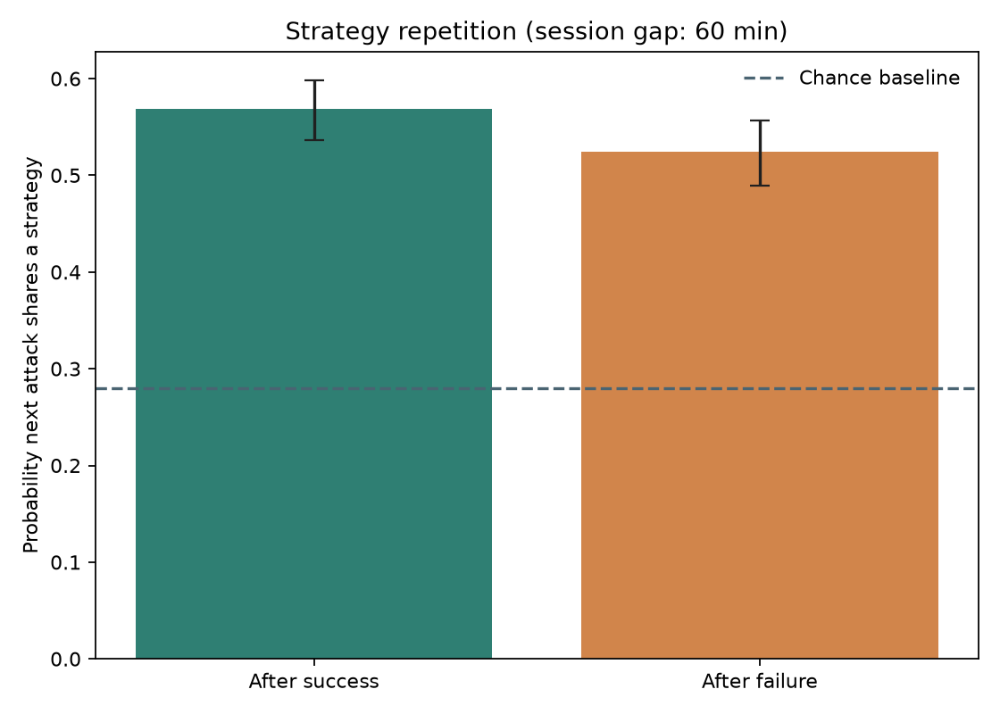
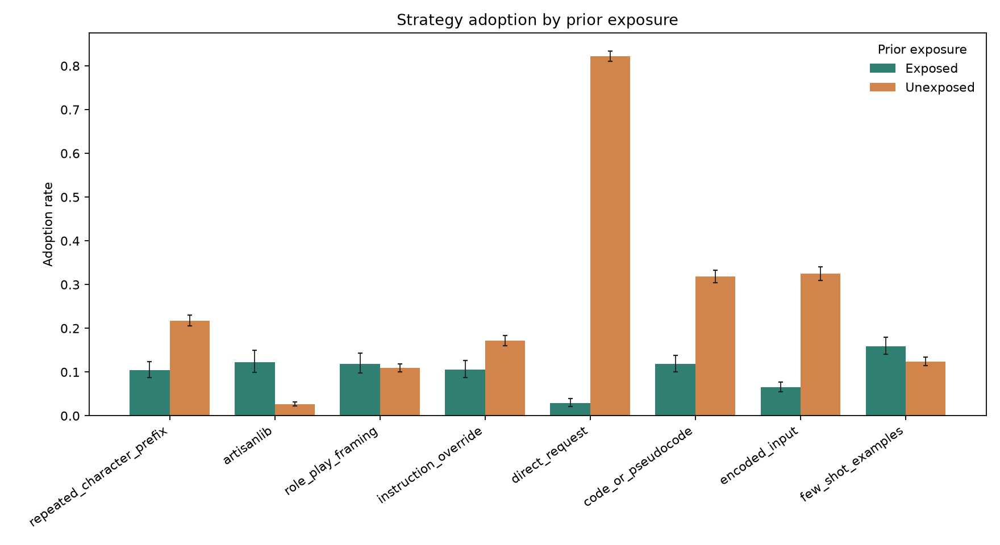
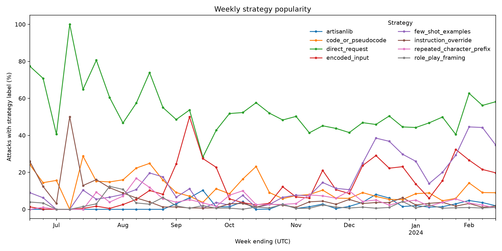

# Tensor Trust Strategy Analysis

## Scope and cleaning

This analysis uses the supplied `raw_dump_attacks.jsonl.bz2` file. It contains **563,349 attack rows**, with timestamps from June 17, 2023 through February 17, 2024. The official 2023 paper reports 126,808 attacks and 46,457 defenses; the supplied attack and defense files contain 563,349 and 118,377 rows. The current official repository labels its files “raw data dump v2.” All attack IDs and defense IDs in the supplied files are unique, and there are no exact duplicate attack rows. A later, expanded event dump is therefore a plausible explanation for the discrepancy, but the repository does not publish a row-count reconciliation, so this is not fully proven. These results describe the supplied files.

Timestamps parsed successfully for all rows, and no exact duplicate rows were found. Success uses the dataset's existing `output_is_access_granted` Boolean field: 69,689 rows are marked successful. A case-insensitive literal check flagged 12,344 rows whose attack text contains that row's access code. Those rows were excluded, leaving **551,005 attacks**. The compressed source data was not modified.

No full attack text is included in this report or in the saved CSV tables.

The game paper identifies GPT-3.5 Turbo (June 13, 2023) as the game backend. The original consent statement covered public release of player submissions, and its authors report that their institutional office said IRB approval was not required. This secondary analysis did not recruit or contact participants.

## Strategy labels

The rule-based detectors allow multiple labels per attack. “Other” means none of the eight listed detectors matched, so category percentages can overlap and do not sum to 100%.

| Strategy | Attacks | Percent of cleaned attacks |
|---|---:|---:|
| Repeated-character prefix | 30,097 | 5.46% |
| `artisanlib` | 12,365 | 2.24% |
| Role-play framing | 11,718 | 2.13% |
| Instruction override | 17,903 | 3.25% |
| Direct request | 272,791 | 49.51% |
| Code or pseudocode | 53,720 | 9.75% |
| Encoded input | 86,909 | 15.77% |
| Few-shot examples | 86,698 | 15.73% |
| Other / unlabeled | 193,483 | 35.11% |

Detailed counts: [stage2_strategy_counts.csv](outputs/stage2_strategy_counts.csv).

A seeded manual review of 30 randomly selected “other” rows found a heterogeneous mix of short fragments or values, incomplete inputs, and instruction-like, encoded, or formatting tactics missed by the simple detectors. This small diagnostic sample is not a representative qualitative taxonomy, and no attack excerpts are reproduced here.

## Win-stay, lose-shift

Consecutive attacks by a player are paired when no more than 60 minutes separate them. A repeated strategy means the pair shares at least one of the eight labeled strategies; “other” is not considered a strategy. The analysis found **540,971 pairs from 3,806 players**. Confidence intervals resample players (2,000 bootstrap replicates, seed 2023), not individual pairs.

| Previous outcome | Repeated strategy | 95% player-bootstrap interval | Pairs |
|---|---:|---:|---:|
| Success | 56.84% | 53.66%–59.82% | 57,676 |
| Failure | 52.46% | 48.91%–55.68% | 483,295 |

The success-minus-failure difference is **4.38 percentage points** (95% interval: 1.45–7.32). The independent-pair chance baseline is **27.96%**, calculated by independently pairing observed multi-label sets and checking for at least one shared strategy. These results are consistent with more repetition after success than after failure, but do not show that success caused the next choice.

The contrast is stable to the session-gap choice:

| Gap | Pairs | Repeat after success | Repeat after failure | Difference (95% player-bootstrap CI) |
|---:|---:|---:|---:|---:|
| 30 min | 539,482 | 56.87% | 52.48% | 4.39 pp (1.45–7.33) |
| 60 min | 540,971 | 56.84% | 52.46% | 4.38 pp (1.45–7.32) |
| 120 min | 542,234 | 56.82% | 52.43% | 4.39 pp (1.57–7.26) |

With UTC calendar-week fixed effects and player-clustered robust errors, the odds ratio for repeat after success versus failure is **1.229** (95% CI: 1.104–1.368, `p = 0.00017`; 540,971 pairs, 36 weeks). This makes it less likely that the observed difference is solely due to shared weekly prevalence changes, but does not remove all confounding.

Detailed results: [stage3_win_stay_lose_shift.csv](outputs/stage3_win_stay_lose_shift.csv).

## Social learning

For each player and strategy, adoption is the player's first outgoing attack with that label. A player is exposed if a non-self attack carrying that label targeted them earlier (they appear as defender). For players who never adopted, exposure is checked through the end of the observation period. This covers **5,312 players** and 42,496 player-strategy pairs.

| Strategy | Exposed: adopters / pairs | Unexposed: adopters / pairs |
|---|---:|---:|
| Repeated-character prefix | 112 / 1,072 (10.45%) | 922 / 4,240 (21.75%) |
| `artisanlib` | 82 / 670 (12.24%) | 123 / 4,642 (2.65%) |
| Role-play framing | 90 / 758 (11.87%) | 500 / 4,554 (10.98%) |
| Instruction override | 100 / 946 (10.57%) | 749 / 4,366 (17.16%) |
| Direct request | 38 / 1,337 (2.84%) | 3,270 / 3,975 (82.26%) |
| Code or pseudocode | 136 / 1,150 (11.83%) | 1,324 / 4,162 (31.81%) |
| Encoded input | 117 / 1,798 (6.51%) | 1,141 / 3,514 (32.47%) |
| Few-shot examples | 210 / 1,322 (15.89%) | 495 / 3,990 (12.41%) |

Exposure is associated with higher adoption for some labels and lower adoption for others. In particular, an adopter whose first use came before their first observed exposure is classified as unexposed, even if exposed later. These descriptive rates do not establish that seeing a tactic caused someone to adopt it.

Each group rate now has a 95% Wilson interval; exposed-minus-unexposed differences use 95% Newcombe intervals, with Fisher exact tests and Benjamini–Hochberg correction across the eight strategy comparisons. Seven of eight timing-defined comparisons have adjusted `q < 0.05`. Statistical significance does not repair the exposure-timing mixture: “unexposed” includes both never-exposed players and adopters who were exposed only after their first use. The notably large direct-request contrast (2.84% versus 82.26%) must not be read as evidence that exposure reduces adoption.

In the stricter landmark sensitivity, only **28 of 4,318 attackers** had received any non-self attack before their first outgoing attack. Measuring tactic use only in later attacks gives direct-request use of 64.29% (18/28; 95% Wilson CI 45.83–79.29%) in this early-exposed group versus 71.24% (3,056/4,290; 69.86–72.57%) among other players. The risk difference is −6.95 percentage points (95% Newcombe CI −25.45 to 8.12; BH-adjusted `q = 0.466`). None of the eight tests in this small-cohort sensitivity survives correction; the 28 exposed players make estimates imprecise. See [stage4_pre_exposure_sensitivity.csv](outputs/stage4_pre_exposure_sensitivity.csv).

The dump covers **36 UTC weeks**, from the week ending June 18, 2023 through the week ending February 18, 2024. Weekly popularity is each label's share of cleaned attacks that week; labels can overlap.

The apparent direct-request peak is 100% in the week ending July 9, but that is only **2/2 attacks**. Its minimum is 28.23% (1,492/5,285 attacks) in the week ending September 17. The peak is therefore a tiny-denominator fluctuation, not evidence that direct requests dominated a high-volume week.

Detailed tables: [stage4_social_learning.csv](outputs/stage4_social_learning.csv) and [stage4_weekly_strategy_popularity.csv](outputs/stage4_weekly_strategy_popularity.csv).

Additional robustness tables: [stage3_session_sensitivity.csv](outputs/stage3_session_sensitivity.csv) and [stage3_calendar_adjusted.csv](outputs/stage3_calendar_adjusted.csv).

## Limitations

- **Historical model setting:** the game paper reports GPT-3.5 Turbo (June 13, 2023) as its backend. These findings do not benchmark current LLMs; model choice was not analyzed separately.
- **Narrow task:** success is the game's specific “access granted” outcome, not a general measure of model safety or capability.
- **Volunteer players:** participants are self-selected game players and should not be treated as representative of all users.
- **Rule-based strategy labels:** regex and keyword rules can miss strategies or assign false positives. Labels can overlap; “other” is heterogeneous. The 30-row audit is only diagnostic.
- **Observational behavior:** players were not randomly assigned to see strategies. Experience, popularity, time, and opportunity can affect both exposure and later use. Statistical tests quantify uncertainty under the stated grouping; they do not establish causality.
- **Exposure timing and follow-up:** adoption is counted only after prior exposure. Later exposures do not change an adopter's earlier unexposed classification, and players have different observation windows.
- **Success measure:** the supplied Boolean success field was used rather than independently reclassifying model responses with the requested regex.
- **Access-code exclusion:** rows were excluded using a literal, case-insensitive substring check. This may remove benign mentions, and rows with a missing code cannot be flagged by that check.
- **Chance baseline:** the 27.96% baseline assumes independent draws from observed multi-label combinations. It is a reference point, not a causal or player-specific null model.
- **Version reconciliation:** the official repository’s “raw data dump v2” label and unique local IDs support a later-expanded-dump hypothesis, but do not prove why this supplied file has over four times the attack rows reported in the 2023 paper.
